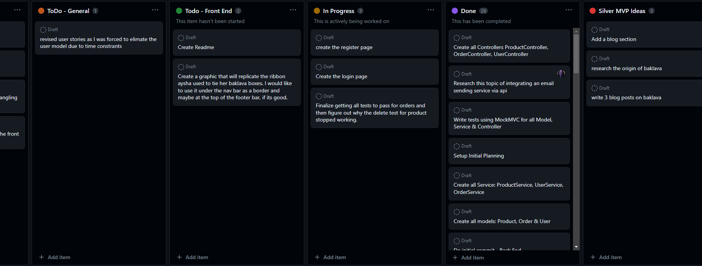
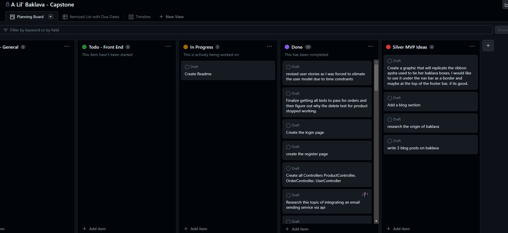

# A Lil' Baklava - Capstone Project

Layered Perfection in Every Bite!

## Tables of Contents

- [Project Overview](#project-overview)
- [Project Planning](#project-planning)
- [User Stories](#user-stories)
- [Wireframe](#user-stories)
- [MVP](#mvp-------completed-------not-completed)
- [Favorite Parts](#favorite-parts)
- [Wins & Hurdles](#wins--hurdles)
- [Technologies & Tools](#technologies--tools)
- [Credits](#credits)

***

## Project Overview

This is my Capstone project for the Interapt / General Assembly Apprenticeship Cohort. 
The theme of this Capstone is my daughter's baklava business. The project involves building 
both the backend using Java/Springboot and the frontend using Angular.  This is the frontend part of the project.

***

## Project Planning

### Progress Snapshot 1

  

### Progress Snapshot 2

  

[View Planning Kanban Board](https://github.com/users/pammie89/projects/1)

***
## User Stories

- As a user, I should be able place an order 
- As a user, I should be able to see a product gallery 
- As a user, I should be able get in touch with the baker 
- As a user, I should be able to reach company by social links 
- As a user, I should be able to place an order 
- As a user, I should be able to receive a confirmation page of order submission 
- As a admin, I should be able to access an admin page to view orders  
- As a admin, I should be able to add products  
- As a admin, I should be able to edit products  
- As a admin, I should be able to delete products  

***