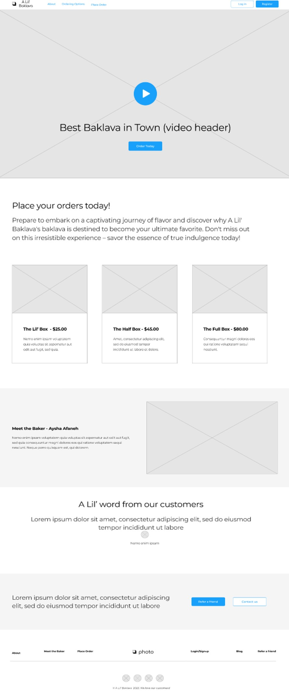

# A Lil' Baklava - Capstone Project

Layered Perfection in Every Bite!

## Tables of Contents

- [Project Overview](#project-overview)
- [Project Planning](#project-planning)
- [User Stories](#user-stories)
- [Wireframe](#user-stories)
- [MVP](#mvp-------completed-------not-completed)
- [Favorite Parts](#favorite-parts)
- [Wins & Hurdles](#wins--hurdles)
- [Technologies & Tools](#technologies--tools)
- [Credits](#credits)

***

## Project Overview

This is my Capstone project for the Interapt / General Assembly Apprenticeship Cohort. 
The theme of this Capstone is my daughter's baklava business. The project involves building 
both the backend using Java/Springboot and the frontend using Angular.  This is the frontend part of the project.

[Backend Part of the Project](https://github.com/pammie89/A-Lil-Baklava-Store-Back-End)
***

## Project Planning

### Progress Snapshot 1

  

### Progress Snapshot 2

  

[View Planning Kanban Board](https://github.com/users/pammie89/projects/1)

***
## User Stories

- As a user, I should be able place an order 
- As a user, I should be able to see a product gallery 
- As a user, I should be able get in touch with the baker 
- As a user, I should be able to reach company by social links 
- As a user, I should be able to place an order 
- As a user, I should be able to receive a confirmation page of order submission 
- As a admin, I should be able to access an admin page to view orders  
- As a admin, I should be able to add products  
- As a admin, I should be able to edit products  
- As a admin, I should be able to delete products  

***

## MVP ( - ✓ - Completed / - ✗ - Not Completed)

1. Should be developed with Angular. - ✓
2. Should consist of Bootstrap styling - ✓
3. Should have a navigation bar that appears on every page. - ✓
4. Should consist of 3 products. - ✓
5. Should have a product gallery. - ✓
6. Should have an admin page. - ✓
7. Should have product photos. - ✓
8. Should connect to the backend - ✓
9. Utilize KISS & DRY Principals. - ✓
10. Utlize git branches. - ✓

## Silver MVP ( - ✓ - Completed / - ✗ - Not Completed)

1. Add a blog section - ✗
2. Have a shopping cart - ✗
3. Implement payment gateway - ✗

***

## Wireframe

  

***

## Favorite Parts

My favorite part is the design aspect of this part of the project. 
It effectively portrays and visually promotes the product it was created for.

***

## Wins & Hurdles

#### <ins>Wins</ins>

I have experienced many wins throughout the duration of this project, below are a few in which I hold most dear.

- Very proud that my first full stack app developed will benefit my daughters business.
- Enjoyed seeing the connections between the front and backends.
- Gained more bootstrap experienc, as I have never worked with it with Angular before.

#### <ins>Hurdles</ins>

I didn't experience too many hurdles in the frontend, however I did run into some issues with connecting the endpoints.

   

***

## Technologies & Tools

- GitHub Project
- Angular Framework
- Angular Router
- Node.js
- Bootstrap
- HttpClient

***

## Credits

- I used this resource for my social icons [Flaticon](https://www.flaticon.com/free-icons/instagram) and [Pixabay](https://pixabay.com) for header graphic 
- I utilized figma to create my wireframe [Figma](http://figma.com).

- I want to express my heartfelt gratitude to [Suresh](https://github.com/sureshmelvinsigera), [Leo](https://github.com/LRodriguez92) and [Dhrubo](https://www.linkedin.com/in/dhrubo-hasan/).   Their teachings over the past three months made it possible for me to finish building a full stack app using Java/Springboot and Angular. I couldn't have done it without them!

***
